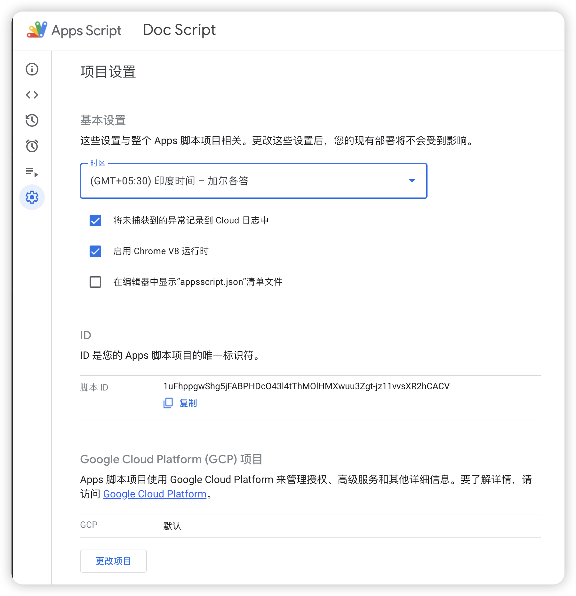

# Google Apps Script

### 开始使用

**1.** 克隆仓库并安装 npm 依赖。

```
npm install
```

**2.** 登录 Google clasp 并使用您的 Google 账号进行授权。

```
npx clasp login
```

**3.** 拉取现有文档或表格的 Apps Script 代码

找到你的 App Script 的 ID , 并编辑 .clasp.json 文件 填入 scriptId



然后拉取代码

```
npx clasp pull
```

**4.** 在 [appsscript.json](./appsscript.json) 文件中包含必要的 [OAuth 权限](./scopes.md)，目前只包含 `spreadsheets` 和 `documents` 以及 `userinfo.email` 权限。

**5.** 开始开发

```
npm run dev
```

**6.** 部署项目或将项目推送到 Google Apps Script

```
npm run deploy // 部署项目到 Google Apps Script

npm run upload // 推送项目到 Google Apps Script
```

### 常见问题

1. clasp 登录失败

检查网络环境,最好开启 `Tun` 或者 `增强模式`

2. 上传代码失败

检查 dist 中代码是否存在，上传代码前需要先执行 `npm run dev` 或者 `npm run build`

3. 无法看到执行效果

想要看到具体的执行效果，需要将代码上传或者部署到 Google Apps Script 中，执行函数

4. 执行失败

检查代码中是否存在错误，或者检查 OAuth 权限是否正确
